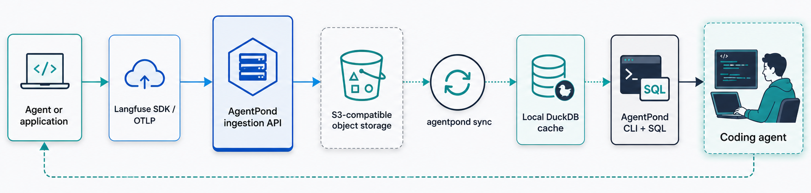

<p align="center">
  
</p>

<p align="center">
  <strong>Store agent traces remotely. Analyze them locally. Keep control of the data.</strong>
</p>

<p align="center">
  <a href="https://github.com/marcusschiesser/agentpond/actions/workflows/ci.yml"></a>
  <a href="https://www.npmjs.com/package/agentpond"></a>
  <a href="https://www.npmjs.com/package/agentpond"></a>
  <a href="https://github.com/marcusschiesser/agentpond/blob/main/LICENSE"></a>
  <a href="https://www.npmjs.com/package/agentpond"></a>
</p>

AgentPond is a lightweight, self-hosted trace backend and CLI for AI agents. It accepts traces from Langfuse SDKs and OTLP, stores raw events in a cloud object storage, and syncs them into a local DuckDB cache for fast analysis.

It is designed for AI projects that want to:

- keep production traces and human annotations in their own infrastructure
- inspect traces through a CLI or SQL
- let coding agents analyze failures and propose regression tests
- avoid operating a full observability platform

AgentPond provides Langfuse-compatible ingestion endpoints, so supported Langfuse SDK integrations can send traces to AgentPond by changing their base URL and credentials.

> AgentPond is an alternative ingestion backend, not a replacement for the complete Langfuse product. It does not provide Langfuse's web UI, prompt management, datasets, or evaluation workflows.

## How it works



The object storage is the source of truth. The local DuckDB database is a rebuildable cache optimized for fast analytical queries.

This gives you durable remote storage without requiring an always-on analytical database. Developers and coding agents can sync the latest production data, query it locally, identify recurring failures, and use those findings to improve the agent.

## Features

- Langfuse-compatible ingestion endpoints for SDK and OTLP traces
- Use AWS S3, Google Cloud Storage or local filesystem as raw event storage
- UTC bucket discovery and incremental synchronization
- Local DuckDB cache containing:
  - `events_raw`
  - `traces`
  - `observations`
  - `scores`
  - `sessions`
- CLI commands to create, list, and inspect traces, observations, sessions, and scores
- Human annotations represented as scores
- Custom SQL queries against synchronized trace data

## Intentional non-goals

AgentPond deliberately does not include:

- **A web UI:** developers and coding agents interact with the CLI and SQL
- **Always-on databases:** no Postgres, ClickHouse, or Redis
- **Background processing infrastructure:** no worker queues
- **Prompt or dataset management:** prompts, test cases, and generated evaluations can remain in your Git repository
- **Hosted trace storage:** you choose and control the object-storage infrastructure

A full observability platform is a better choice when you need shared dashboards, hosted evaluation workflows, or non-technical team access.

AgentPond is intended for projects whose main requirement is private, durable trace storage with programmable local analysis.

## Quick start

### Prerequisites

You need:

- Node.js and npm

Install the AgentPond CLI:

```sh
npm install -g agentpond
```

### Create and query a trace

Create a test trace directly through the CLI:

```sh
agentpond traces create \
  --name "checkout support answer" \
  --userId user_42 \
  --sessionId demo-session \
  --metadata '{"feature":"checkout","model":"gpt-5.5-mini"}' \
  --input '{"question":"Why was my card declined?"}' \
  --output '{"answer":"The bank declined the authorization. Please try another card or contact your bank."}'
```

Inspect the trace:

```sh
agentpond traces list
agentpond sql "select id, name, session_id from traces"
```

For the complete command reference, see [CLI usage](./docs/cli.md).

## Example projects

The repository contains scenario-based examples under [examples](./examples/README.md):

- [Basic traces](./examples/basic-traces/README.md): fixture-based Python and TypeScript examples that emit traces, observations, and annotation scores without calling an LLM.
- [LLM compliance workflow](./examples/llm-compliance/README.md): a Python `uv` example that calls OpenAI, parses a structured compliance score, and records the workflow in Langfuse.

Each scenario README includes prerequisites and run commands.

## Use AgentPond in your project

AgentPond implements Langfuse-compatible ingestion endpoints. To send traces to AgentPond, use the normal Langfuse SDK integration for your language or framework.

See the [Langfuse SDK overview](https://langfuse.com/docs/observability/sdk/overview) for SDK installation and instrumentation instructions.

### Environments

AgentPond keeps dev, staging, and production data separate by environment.

#### Development

AgentPond provides a local Langfuse-compatible ingestion server for development. To start it, just call:

```sh
agentpond dev
```

Your project can then use `agentpond env get dev` to get the environment values needed to use this ingestion server with the Langfuse SDK. You can copy those values to your project's `.env` file or call this before running the dev server:

```sh
eval "$(agentpond env get dev)"
```

#### Staging and production

For staging and production services, you need to deploy the AgentPond ingestion service together with an object store in your infrastructure. [docker-compose.yml](./docker-compose.yml) provides a template for such a deployment that you can run locally with `docker compose up --build`. AWS deployments can use `lambdaIngestHandler` from `@agentpond/aws` for Lambda Function URLs or API Gateway HTTP API v2, and Google deployments can use `httpIngestFunction` from `@agentpond/google` for HTTP Cloud Functions.

To point AgentPond to this service, call the `env init` command in your project:

```sh
agentpond env init <env-name>
```

The command prompts for an infrastructure provider (AWS, Google or local) in an interactive terminal. 

Using `staging` for `env-name`, this generates a `.agentpond/envs/staging.env` file that you need to update with the ingestion and object-store settings for your deployed AgentPond services.

Then you can call:

```sh
agentpond env use staging
```

After that, `agentpond` queries traces from the selected staging environment by default.

### Add coding agent

After sending traces to AgentPond, you need to give your coding agent the skill to access AgentPond:

```sh
npx skills add marcusschiesser/agentpond
```

This command installs a skill to use the AgentPond CLI, understand its DuckDB schema for advanced queries, and provides trace-analysis guidance to help improve your agents.


## Development

Install the workspace dependencies:

```sh
pnpm install
```

Run the CLI directly from the source tree:

```sh
pnpm cli --help
```
